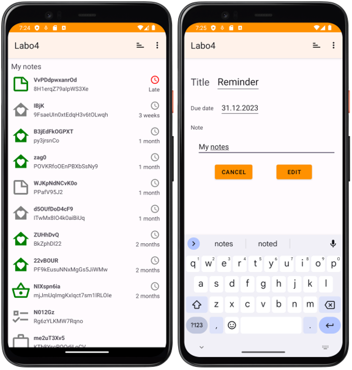
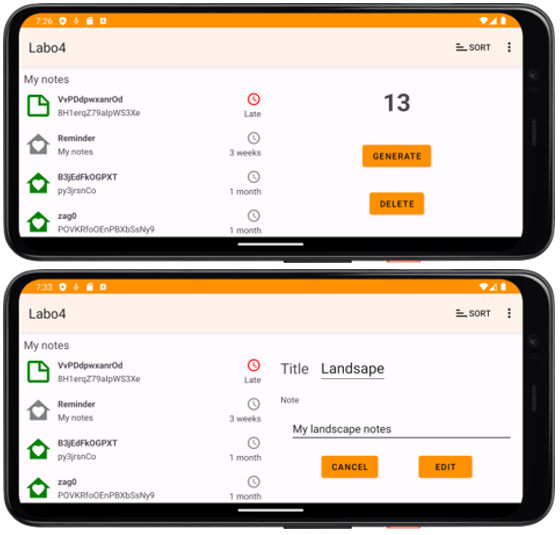
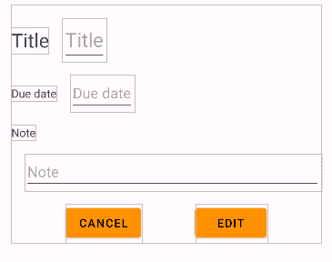

# HEIG DAA Labo 4 - Architecture MVVM

 **Auteurs** : Timothée Van Hove, Léo Zmoos

**Date** : 04.12.2023

## Introduction 

Ce laboratoire consiste au développement d’une application Android basée sur une architecture MVVM et disposant d’une base de données Room. L'application permettra, en outre à s'adapter à plusieurs configurations du système de forme telles que l'affichage en mode paysage et l'affichage pour écran de tablette.





## Choix d'implémentation

### ViewBinding

Nous avons utilisé le viewBinding dans tous les fragments et activités, ainsi que dans l'adapter pour améliorer la clarté et la sécurité du type en nous fournissant un moyen direct d'interagir avec les vues de l'interface utilisateur. 

L'accès aux vues du layout. L'utilisation du ViewBinding dans l'adapter nécessite quelques arrangements:

* Nous devons wrapper le contenu de layout dans une balise <layout> pour la liaison des données.
* Nous devons utiliser `ViewBinding` comme type de base pour le `ViewHolder`. Cela permet de gérer différents types de vues (Note et NoteSchedule). Nous pouvons alors attribuer le type approprié dans la méthode bind pour définir les données en conséquence.

De plus, l'utilisation de ViewBinding est légèrement différente dans un fragment comparé à son utilisation dans une activité:

- Dans une activité, le binding est créé et nettoyé dans les méthodes `onCreate` et `onDestroy`. Le ViewBinding dans une activité est relativement directe car le cycle de vie de l'activité est simple et clair.
- Dans un fragment, le binding est créé dans `onCreateView` et nettoyé dans `onDestroyView`. Cette distinction est importante car la vue du fragment peut être créée et détruite plusieurs fois au cours du cycle de vie du fragment lui-même. Il est donc crucial de nettoyer le binding dans `onDestroyView` pour éviter les fuites de mémoire, car les références conservées dans le binding peuvent prolonger inutilement la durée de vie des vues du layout.

### AsyncListDiffer & NotesDiffCallback

Pour gérer les mises à jour de données dans notre adaptateur de manière performante, nous avons choisi d'utiliser `AsyncListDiffer` accompagné de `NotesDiffCallback`. L'`AsyncListDiffer` est un outil qui optimise les mises à jour de la liste en calculant les différences entre les anciennes et les nouvelles listes de données de manière asynchrone, sur un thread en arrière-plan. Cela permet de ne pas bloquer le thread principal de l'interface utilisateur lors des mises à jour, garantissant ainsi une expérience utilisateur fluide, même avec de grandes quantités de données ou des modifications fréquentes. Le `NotesDiffCallback`, est une implémentation de `DiffUtil.ItemCallback` spécifique à nos objets `NoteAndSchedule`. Il définit comment déterminer si deux objets sont identiques (`areItemsTheSame`) et si leur contenu est identique (`areContentsTheSame`). 

Cette approche est plus optimisée par rapport à l'utilisation directe de `DiffUtil.Callback`, et présente les avantages suivants:

1.  `AsyncListDiffer`, en utilisant `DiffUtil.ItemCallback`, permet de calculer les différences entre les listes de manière asynchrone. Donc le traitement de comparaison des éléments est effectué en arrière-plan, évitant de bloquer le thread principal, particulièrement pour des listes volumineuses ou des mises à jour fréquentes.
2. Contrairement à une mise à jour manuelle de l'ensemble des éléments, `AsyncListDiffer` ne met à jour que les éléments qui ont été effectivement modifiés, ajoutés ou supprimés. Cela entraîne une performance accrue et des animations plus fluides lors des changements dans la liste.

### Absence de Layout Spécifique pour Tablettes

Nous n'avons pas implémenté de layout spécifique pour les tablettes. La principale raison est que nous avons choisi de ne pas télécharger un virtual device pour tablette afin d'économiser de l'espace disque.

Même si nous n'avons pas concrètement implémenté un layout pour tablette, nous sommes conscients des étapes nécessaires pour le faire. Voici une brève explication :

1. **Création de Dossiers de Ressources Spécifiques** : Pour supporter les tablettes, il faut créer des dossiers de ressources supplémentaires dans le projet, tels que `layout-sw600dp` pour les petits écrans de tablette et `layout-sw720dp` pour les plus grands. Ces dossiers contiendraient des versions adaptées des fichiers XML de layout, optimisées pour l'utilisation sur des écrans plus grands.
2. **Conception Réactive** : La conception de ces layouts nécessiterait une approche réactive, en utilisant un `ConstraintLayout`, comme nous l'avons fait pour les fragments de l'app mobile.
3. **Fragments et Navigation** : Nous aurions du changer légèrement le code dans le `EditFragment` pour supporter le mode tablette, car l'affichage du `ControlFrgment` et du EditFragment seraient permanents, même en cas de rotation de l'écran.


## Questions

### Question 1

```
Quelle est la meilleure approche pour sauver, même après la fermeture de l’app, le choix de l’option de tri de la liste des notes ? Vous justifierez votre réponse et l’illustrez en présentant le code mettant en œuvre votre approche.
```

La manière dont nous avons implémenté cette feature est l'utilisation de `SharedPreferences` pour sauver l'état du tri. Ces dernières permettent de stocker des données primitives dans des paires clé-valeur, ce qui est idéal pour enregistrer des paramètres ou des préférences simples. Pour l'implémenter:

#### 1. Modifier le ViewModelFactory

Il faut modifier le ViewModelFactory, pour pouvoir lui passer le contexte en paramètres:

```Kotlin
class ViewModelNotesFactory(private val repository: Repository, private val context: Context) : ViewModelProvider.Factory {
    override fun <T : ViewModel> create(modelClass: Class<T>): T {
        if (modelClass.isAssignableFrom(ViewModelNotes::class.java)) {
            return ViewModelNotes(repository, context) as T
        }
        throw IllegalArgumentException("Unknown ViewModel class")
    }
}
```


#### 2. Modifier la création du VM dans le fragment pour lui passer le contexte de l'app

```Kotlin
private val viewModel: ViewModelNotes by activityViewModels {
    ViewModelNotesFactory((requireActivity().application as App).repository, requireActivity().application)
}
```


#### 3. Modifier la création du VM dans l'activité pour lui passer le contexte de l'app

```Kotlin
private val viewModel: ViewModelNotes by viewModels {
    ViewModelNotesFactory((application as App).repository, applicationContext)
}
```


#### 4. Modifier le VM pour accepter le contexte de l'app en paramètres

```Kotlin
class ViewModelNotes(private val repository: Repository, context: Context) : ViewModel() {
}
```


#### 5. Enregistrer l'option de tri dans les SharedPreferences

Maintenant que nous avons accès au contexte, nous pouvons récupérer les `SharedPreferences` dans le VM. Chaque fois que l'option de tri change dans le `ViewModel`, il faut enregistrer ce changement:

```kotlin
class ViewModelNotes(private val repository: Repository, context: Context) : ViewModel() {
    private val sharedPreferences = context.getSharedPreferences("NotePreferences", Context.MODE_PRIVATE)

    private val _sortOrder = MutableLiveData<Sort>().apply {
        value = Sort.values()[sharedPreferences.getInt("sortOrder", Sort.NONE.ordinal)]
    }
    val sortOrder: LiveData<Sort> = _sortOrder

    // (...)

    fun setSortOrder(sortOrder: Sort) {
        _sortOrder.value = sortOrder
        with(sharedPreferences.edit()) {
            putInt("sortOrder", sortOrder.ordinal)
            apply()
        }
    }
}
```

**Note :** Les ViewModels sont conçus pour survivre à des instanciations spécifiques de vues ou à des propriétaires de cycle de vie tels que les activités et les fragments, de sorte qu'une référence directe à ces derniers peut les empêcher d'être `garbage collectés`, ce qui entraînerait des fuites de mémoire. Cependant, l'utilisation du contexte de l'application est sûre, car il est lié au cycle de vie de l'application, et non au cycle de vie d'une activité ou d'un fragment. Par conséquent, le passage du contexte d'application au ViewModel ne présente pas le même risque de fuite de mémoire que le passage du contexte d'une activité ou d'un fragment.

Dans note fragment`requireActivity().application` est utilisé pour transmettre en toute sécurité le contexte de l'application au modèle de visualisation. Il n'y a pas de risque de fuite de mémoire car le contexte d'application est global et existe tant que l'application est en vie.
Il est important de noter que dans le ViewModel, nous n'utilisons ce contexte que pour des opérations qui sont appropriées au contexte de l'application (comme l'accès à des préférences ou des ressources partagées) et non pour des opérations qui nécessitent un contexte d'activité ou de fragment (comme `l'inflate` de vues ou l'affichage de toasts).

### Question 2

```
L’accès à la liste des notes issues de la base de données Room se fait avec une LiveData. Est-ce que cette solution présente des limites ? Si oui, quelles sont-elles ? Voyez-vous une autre approche plus adaptée ?
```

**Limitations**

Les mises à jour de LiveData sont envoyées sur le thread principal, ce qui convient pour les ensembles de données de petite ou moyenne taille, mais peut entraîner des problèmes de performance pour les ensembles de données de grande taille ou les requêtes complexes.
La LiveData n'est pas adapté aux cas où nous avons besoin d'effectuer des transformations de flux de données complexes. Il est principalement conçu pour des scénarios simples où les données changent peu souvent.
Contrairement à d'autres bibliothèques réactives (comme RxJava), LiveData ne fournit pas d'opérateurs intégrés pour filtrer, fusionner ou transformer les flux de données.

**Approche alternative : Flow**

Nous pouvons envisager d'utiliser `Kotlin Flow`. Il offre plusieurs avantages. 

1. Prend en charge la gestion du `Backpressure`, ce qui est utile pour traiter des ensembles de données plus importants. 
2. Livré avec un ensemble d'opérateurs pour transformer, combiner et filtrer les flux de données.

3. Prend en charge les coroutines et peut facilement gérer des opérations sur différents threads, ce qui améliore les performances pour les opérations de base de données complexes.

Pour utiliser `Flow` dans Room, nous devons définir le DAO de manière à ce qu'il renvoie un type `Flow` :

```Kotlin
@Dao
interface NotesDao {
    @Query("SELECT * FROM notes")
    fun getAllNotes() : Flow<List<Note>>
}
```

Dans le ViewModel, nous pouvons collecter ces flux et mettre à jour nos `LiveData` ou exposer directement les flux à l'interface utilisateur, en les collectant dans le `lifecycleScope` des Fragments.

Les `LiveData` et les flux ont tous deux leurs cas d'utilisation, et le choix dépend des besoins spécifiques et de la complexité de notre application. `LiveData` est souvent suffisant pour des mises à jour directes et réactives de l'interface utilisateur, tandis que `Flow` est plus approprié pour des manipulations de données plus complexes, à plus grande échelle.


### Question 3

```
Les notes affichées dans la RecyclerView ne sont pas sélectionnables ni cliquables. Comment procéderiez-vous si vous souhaitiez proposer une interface permettant de sélectionner une note pour l’éditer ?
```

Nous avons implémenté cette feature dans notre application. Pour implémenter in `clickListener` sur les items de la recyclerView, nous avons suivi les étapes suivantes:

#### 1. Créer le layout du nouveau fragment d'édition

Créer un simple layout permettant d'éditer les données d'un objet `NoteAndSchedule`. Ne pas oublier de l'implémenter dans une `ScrollView`, car ce layout pourrait être trop haut pour l'édition en mode paysage.



#### 2. Créer une interface clickListener

Créer une interface pour gérer les événements de clics sur les éléments. Cette interface sera mise en œuvre par le fragment qui héberge la RecyclerView.

```kotlin
interface OnNoteClickListener {
    fun onNoteClicked(noteAndSchedule: NoteAndSchedule)
}
```


#### 3. Passer l'interface à l'adaptateur et invoquer le listener lors du clic

Modifier le NotesAdapter pour qu'il prenne ce listener en paramètre et qu'il l'affecte à chaque élément de la `RecyclerView`. Dans le ViewHolder, définir un `OnClickListener` pour la vue de l'élément. Dans ce listener, invoquer la méthode de l'interface, en transmettant les données pertinentes (par exemple, l'id de l'objet NoteAndSchedule).

```kotlin
class NotesAdapter(
    private val clickListener: OnNoteClickListener,
    listItems: List<NoteAndSchedule> = listOf()
) :
    RecyclerView.Adapter<NotesAdapter.ViewHolder>() {
        
//(...)
        
    inner class ViewHolder(private val binding: ViewBinding) : RecyclerView.ViewHolder(binding.root) {
    init {
        itemView.setOnClickListener {
            val position = adapterPosition
            if (position != RecyclerView.NO_POSITION) {
                clickListener.onNoteClicked(items[position])
            }
        }
    }
//(...)       
}
```


#### 4. Implémenter l'interface dans le fragment hote

Dans le fragment qui héberge le `RecyclerView`, implémenter l'interface `OnNoteClickListener`. Dans l'implémentation, implémenter la navigation vers le nouveau fragment. Attention, il faut bien gérer l'orientation actuelle de l'écran et passer le bon fragment à remplacer. En mode paysage, remplacer le fragment qui afficher les contrôles et en mode portait, il faut remplacer le fragment principal.

```kotlin
class NotesFragment : Fragment(), OnNoteClickListener {

//(...)

    override fun onNoteClicked(noteAndSchedule: NoteAndSchedule) {
        val editNoteFragment = EditNoteFragment().apply {
            arguments = Bundle().apply {
                noteAndSchedule.note.noteId?.let { putLong("noteId", it) }
            }
        }

        val isLandscape = resources.configuration.orientation == Configuration.ORIENTATION_LANDSCAPE
        val containerId = if (isLandscape) {
            R.id.fragment_container_controls
        } else {
            R.id.fragment_container_notes
        }

        // Replace the current fragment with the new one
        activity?.supportFragmentManager?.beginTransaction()
            ?.replace(containerId, editNoteFragment)
            ?.addToBackStack(null)
            ?.commit()
    }
    
    //(...)
    
}
```


#### 5. Gérer les données dans le nouveau fragment

Dans le nouveau fragment, récupérer  l'objet NoteAndSchedule et l'utiliser pour remplir les champs d'édition. Ici (comme dans les autres fragments/activités), nous avons utilisé le viewBinding pour ne pas devoir récupérer les vues avec `findViewById`.

Le fragment va récupérer l'id de l'objet `NoteAndSchedule`, puis va appeler la méthode `getNoteById` que nous avons créé dans le ViewModel. Ensuite, nous affichons les données de la note dans la layout. Finalement nous implémentons les `onClickListener` du bouton `EDIT` pour mettre à jour les données de la note en utilisant la méthode `updateNoteAndSchedule` que nous avons aussi implémenté dans le ViewModel.

```kotlin
class EditNoteFragment : Fragment() {

//(...)

    override fun onViewCreated(view: View, savedInstanceState: Bundle?) {
        super.onViewCreated(view, savedInstanceState)

        val noteId = arguments?.getLong("noteId", -1L) ?: -1L
        var noteAndSchedule: NoteAndSchedule? = null

        // Use ViewModel to fetch data using noteId
        viewModel.getNoteById(noteId).observe(viewLifecycleOwner) { note ->
            noteAndSchedule = note
            note?.let {
                with(binding) {
                    val scheduleDate = it.schedule?.date
                    editTextTitle.setText(it.note.title)
                    editTextContent.setText(it.note.text)
                    editTextDate.textColors

                    if (scheduleDate != null) {
                        editTextDate.setText(scheduleDate?.let { date -> formatDate(date) })
                    } else {
                        editTextDate.visibility = View.GONE
                        textViewDate.visibility = View.GONE
                    }
                }
            }
        }

        binding.buttonEdit.setOnClickListener {
            if (noteAndSchedule != null) {
                viewModel.updateNoteAndSchedule(
                    noteId,
                    binding.editTextTitle.text.toString(),
                    binding.editTextContent.text.toString()
                )
            } else {
                Toast.makeText(view.context, "Error editing the note", Toast.LENGTH_LONG).show()
            }
            activity?.supportFragmentManager?.popBackStack()
        }

        binding.buttonCancel.setOnClickListener { activity?.supportFragmentManager?.popBackStack() }
    }

//(...)
}
```


#### 6. Ajouter les méthodes `getNoteById` et `updateNoteAndSchedule` dans le ViewModel

Dans le viewModel, ajouter la méthode `getNoteById`, permettant de récupérer une LiveData de NoteAndSchedule pour l'afficher dans le layout. Ensuite, ajouter la méthode `updateNoteAndSchedule` pour modifier le contenu d'une note dans le base de données.

```kotlin
    fun getNoteById(noteId: Long): LiveData<NoteAndSchedule?> {
        return allNotes.switchMap { notes ->
            val liveData = MutableLiveData<NoteAndSchedule?>()
            val noteAndSchedule = notes.find { it.note.noteId == noteId }
            liveData.value = noteAndSchedule
            liveData
        }
    }

    fun updateNoteAndSchedule(noteId: Long, title: String, text: String) {
        repository.editNote(noteId, title, text)
    }
```

Dans le Repository, ajouter la méthode `editNote` pour appeler la query dans le Dao.

```kotlin
    fun editNote(noteId: Long, title: String, text: String) {
        applicationScope.launch {
            dao.updateNote(noteId, title, text)
        }
    }
```

Dans le Dao, implémenter la nouvelle query pour mettre à jour les données dans la base de données

```kotlin
    @Query("UPDATE note SET title = :title, text = :text WHERE noteId = :noteId")
    fun updateNote(noteId: Long, title: String, text: String)
```

Maintenant, nous pouvons clicker sur une note, l'afficher dans un nouveau fragment, et modifier son contenu.

**Note 1 :** Dans un souci de simplicité, nous n'avons pas laissé la possibilité à l'utilisateur de changer la date, mais nous aurions pu le faire en implémentant un `MaterialDateTimePicker` dans le layout d'édition de notes. Idéalement, il aurait aussi fallu laisser la possibilité à l'utilisateur d'ajouter un date dans une note simple, la transformant ainsi en NoteAndSchedule, mais nous ne l'avons pas implémenté.

**Note 2** : La gestion du fragment actuellement implémentée n'est pas parfaite. En mode paysage, nous allons ajouter un fragment sur la pile à chaque fois que nous allons cliquer sur un élément de la liste. Pour faire mieux, nous aurions du simplement remplacer le fragment. Cela éviterai un empilement de fragments inutile.


## Conclusion

Ce laboratoire a été une occasion d'approfondir nos connaissances dans l'utilisation de l'architecture MVVM et la base de données Room. En naviguant à travers les défis de l'implémentation, nous avons non seulement renforcé notre compréhension des bonnes pratiques, mais aussi appris à adapter notre application à différentes configurations d'écran. Nous avons mis l'accent sur la propreté du code, anisi que la création de features supplémentaires, comme l'édition des éléments de la liste et la sauvegarde de l'état du tri.

Ce projet a été un excellent exercice pour combiner diverses technologies vues en cours. Les leçons apprises ici seront sans aucun doute un atout dans nos futurs projets de développement.
